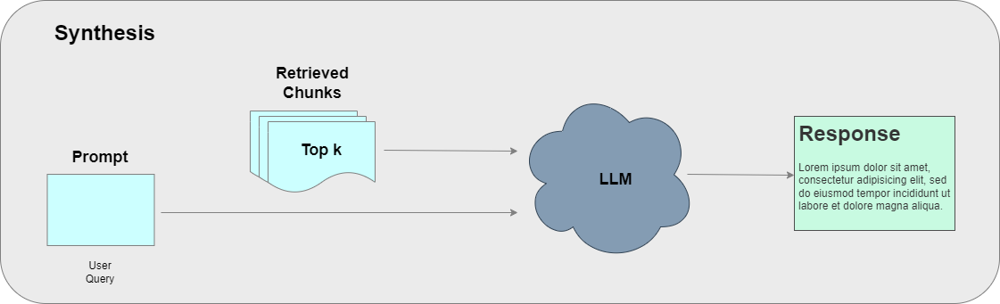

# RAG_Synthesis
This repository contains a Jupyter notebook experimenting the data synthesis pipeline for a retrieval augmented generation (RAG) system. It contains basic code for data synthesis using chains and LLMs.

